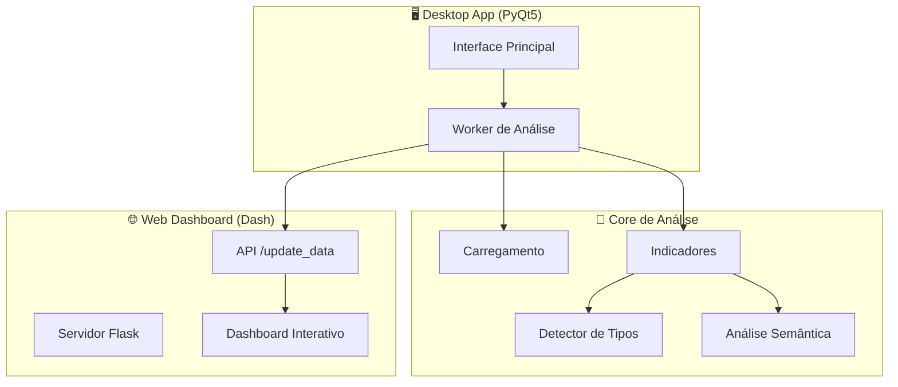

# Analisador de Planilhas Inteligente

*Da Desordem dos Dados à Clareza Estratégica: Análise Semântica e Padronização Automática de Planilhas.*

<!-- Badges de Status -->
[](https://github.com/ESousa97/analisador-de-planilhas-inteligente/actions/workflows/ci.yml)
[](https://github.com/ESousa97/analisador-de-planilhas-inteligente/actions/workflows/codeql.yml)
[](https://github.com/ESousa97/analisador-de-planilhas-inteligente/network/updates)
[](https://opensource.org/licenses/MIT)
[](https://www.python.org/downloads/)
[](https://github.com/astral-sh/ruff)

---

## 📸 Demonstração Visual

### 🖥️ Interface Desktop
<div align="center">
  
  <p><em>Interface principal com análise em tempo real e feedback visual</em></p>
</div>

### 🧠 Análise Inteligente
<div align="center">
  
  <p><em>Agrupamento automático e padronização de dados categóricos</em></p>
</div>

### 📊 Dashboard Interativo

<div align="center">
  
  <p><em>Dashboard web com gráficos dinâmicos e filtros interativos</em></p>
</div>

---

## 🎯 Abstract (Resumo Técnico)

O **Analisador de Planilhas Inteligente** é um sistema híbrido (desktop/web) que revoluciona a análise e padronização de dados tabulares. Utilizando técnicas avançadas de **Processamento de Linguagem Natural (PLN)** e **análise fuzzy**, o sistema automatiza o processo de limpeza e agrupamento de dados categóricos, transformando horas de trabalho manual em minutos de análise automatizada.

A solução combina **algoritmos de similaridade de strings** (`rapidfuzz`) para capturar variações sintáticas com **modelos Transformer** (`sentence-transformers`) para agrupamento semântico, oferecendo uma cobertura completa das inconsistências encontradas em dados reais. A arquitetura híbrida separa o processamento pesado (PyQt5 desktop) da visualização interativa (Dash web), garantindo performance e experiência de usuário superiores.

## 🏆 Badges


---

## 📋 Sumário

1. [🎯 Introdução e Motivação](#-introdução-e-motivação)
2. [🏛️ Arquitetura do Sistema](#️-arquitetura-do-sistema)
3. [⚖️ Decisões de Design](#️-decisões-de-design)
4. [✨ Funcionalidades](#-funcionalidades)
5. [🛠️ Tech Stack](#️-tech-stack)
6. [📂 Estrutura do Projeto](#-estrutura-do-projeto)
7. [📋 Pré-requisitos](#-pré-requisitos)
8. [🚀 Instalação](#-instalação)

9. [⚙️ Uso](#️-uso)
10. [🔧 API Reference](#-api-reference)
11. [🧪 Testes](#-testes)
12. [🚢 Deployment](#-deployment)
13. [🤝 Contribuição](#-contribuição)
14. [📜 Licença](#-licença)
15. [👥 Autor](#-autor)
16. [❓ FAQ](#-faq)

---

## 🎯 Introdução e Motivação

### O Problema
Profissionais de dados gastam até **80% do tempo** em limpeza e padronização de dados. Planilhas do mundo real frequentemente contêm:
- ✗ Variações ortográficas ("Empresa X LTDA", "Empresa X Ltda.", "EmpresaX")
- ✗ Erros de digitação e abreviações inconsistentes
- ✗ Sinônimos conceituais ("restaurante", "lanchonete", "casa de pasto")
- ✗ Formatos de data e CEP inconsistentes

### A Solução
O **Analisador de Planilhas Inteligente** automatiza esse processo através de:
- **🔍 Análise Fuzzy**: Detecta variações sintáticas usando `rapidfuzz`
- **🧠 Análise Semântica**: Agrupa conceitos similares com modelos Transformer
- **📊 Dashboard Interativo**: Visualização web moderna com Plotly/Dash
- **🖥️ Interface Desktop**: Controle nativo com PyQt5

---

## 🏛️ Arquitetura do Sistema



### Fluxo de Dados
1. **📁 Seleção**: Usuário seleciona planilha (CSV, XLSX, XLS)
2. **⚡ Processamento**: Análise assíncrona em thread separada
3. **🔍 Detecção**: Identificação automática de tipos de coluna
4. **🧠 Agrupamento**: Fuzzy + semântico para padronização
5. **📊 Visualização**: Dashboard web com gráficos interativos
6. **📤 Exportação**: Relatórios em CSV e JSON

---

## ⚖️ Decisões de Design

### 🎯 Arquitetura Híbrida
- **Desktop (PyQt5)**: Performance, acesso ao sistema de arquivos, threads controladas
- **Web (Dash)**: Visualizações ricas, interatividade moderna, responsividade

### 🔄 Análise Dual
- **Sintática (RapidFuzz)**: Erros de digitação, abreviações, variações morfológicas
- **Semântica (Transformers)**: Relacionamentos conceituais, sinônimos

### ⚡ Processamento Assíncrono
- **QThread**: Evita travamento da interface
- **Progress Callbacks**: Feedback em tempo real
- **Error Handling**: Tratamento robusto de exceções

---

## ✨ Funcionalidades

### 📊 Análise Inteligente
- ✅ **Detecção automática** de tipos de coluna (texto, numérico, data, ID)
- ✅ **Agrupamento fuzzy** para variações sintáticas
- ✅ **Clustering semântico** para conceitos relacionados
- ✅ **Dicionário especializado** com 900+ termos de domínio
- ✅ **Normalização de CEP** automática

### 📈 Visualização Avançada
- ✅ **5 tipos de gráficos**: Barras, Pizza, Linha, Scatter, Box Plot
- ✅ **Interface responsiva** com tema escuro moderno
- ✅ **Interatividade total** com Plotly
- ✅ **Filtros dinâmicos** e drill-down

### 🔧 Funcionalidades Técnicas
- ✅ **Suporte múltiplos formatos**: CSV, XLSX, XLS
- ✅ **Detecção automática** de encoding e delimitadores
- ✅ **Limpeza inteligente** de dados
- ✅ **Exportação completa** de relatórios
- ✅ **Progress tracking** em tempo real

---

## 🛠️ Tech Stack

### 🐍 Backend & Processamento
| Tecnologia | Versão | Propósito |
|------------|--------|-----------|
| **Python** | 3.8+ | Linguagem principal |
| **Pandas** | Latest | Manipulação de dados |
| **NumPy** | Latest | Operações numéricas |
| **RapidFuzz** | Latest | Similaridade de strings |
| **Sentence-Transformers** | Latest | Embeddings semânticos |
| **Scikit-learn** | Latest | ML e clustering |

### 🖥️ Interface Desktop
| Tecnologia | Versão | Propósito |
|------------|--------|-----------|
| **PyQt5** | Latest | Framework GUI |
| **QDarkStyle** | Latest | Tema escuro |
| **QtAwesome** | Latest | Ícones vetoriais |

### 🌐 Interface Web
| Tecnologia | Versão | Propósito |
|------------|--------|-----------|
| **Dash** | Latest | Framework web analítico |
| **Plotly** | Latest | Visualizações interativas |
| **Flask** | Latest | Servidor web |
| **Dash Bootstrap** | Latest | Componentes UI |

### 📁 Dados & Utilitários
| Tecnologia | Versão | Propósito |
|------------|--------|-----------|
| **openpyxl** | Latest | Leitura Excel |
| **chardet** | Latest | Detecção encoding |
| **unidecode** | Latest | Normalização texto |

---

## 📂 Estrutura do Projeto

```
analisador-de-planilhas-inteligente/
├── 📁 analysis/              # 🧠 Motor de análise
│   ├── __init__.py
│   ├── detector.py           # 🔍 900+ termos de domínio
│   ├── indicator.py          # 📊 Geração de indicadores
│   ├── semantic.py           # 🧠 Análise semântica
│   └── stopwords.py          # 🚫 Limpeza de texto
├── 📁 config/                # ⚙️ Configurações
│   ├── __init__.py
│   └── settings.py           # 🔧 Parâmetros globais
├── 📁 core/                  # 🏗️ Funcionalidades base
│   ├── __init__.py
│   ├── id_generator.py       # 🆔 Geração de IDs
│   ├── loader.py             # 📥 Carregamento de dados
│   └── utils.py              # 🛠️ Utilitários gerais
├── 📁 gui/                   # 🖥️ Interfaces
│   ├── __init__.py
│   ├── app.py                # 🌐 Dashboard Dash
│   └── main_gui.py           # 🖥️ Interface PyQt5
├── 📁 reports/               # 📋 Geração de relatórios
│   ├── __init__.py
│   └── reporter.py           # 📤 Exportação
├── 📄 main.py                # 🚀 Ponto de entrada
├── 📄 requirements.txt       # 📦 Dependências
├── 📄 README.md              # 📖 Este arquivo
└── 📄 .gitignore             # 🚫 Arquivos ignorados
```

---

## 📋 Pré-requisitos

### 💻 Sistema
- **Python 3.8+** (recomendado 3.9+)
- **4GB RAM** mínimo (8GB+ recomendado)
- **1GB espaço** em disco
- **Conexão internet** (primeira execução)

### 🔧 Ferramentas
- **pip** (gerenciador de pacotes)
- **venv** ou **conda** (ambiente virtual)

---

## 🚀 Instalação

### 1️⃣ Clone o Repositório
```bash
git clone https://github.com/ESousa97/analisador-de-planilhas-inteligente.git
cd analisador-de-planilhas-inteligente
```

### 2️⃣ Crie Ambiente Virtual
```bash
# Windows
python -m venv venv
.\venv\Scripts\activate

# macOS/Linux  
python3 -m venv venv
source venv/bin/activate
```

### 3️⃣ Instale Dependências
```bash
pip install -r requirements.txt
```

### 4️⃣ Execute a Aplicação
```bash
python main.py
```

> 🔄 **Primeira execução**: Download automático dos modelos NLP (~500MB)

---

## ⚙️ Uso

### 🖥️ Interface Desktop

1. **📂 Selecione** uma planilha (.csv, .xlsx, .xls)
2. **▶️ Clique** em "Analisar" 
3. **⏳ Aguarde** o processamento (barra de progresso)
4. **📊 Visualize** o resumo na interface
5. **🌐 Abra** o dashboard web para análise detalhada

### 🌐 Dashboard Web

- **🎨 Escolha** o tipo de gráfico no dropdown
- **🔍 Explore** as visualizações interativas
- **📱 Acesse** via `http://127.0.0.1:8050`

### 📤 Exportação

Os relatórios são automaticamente salvos em:
```
output/
├── relatorio_indicadores.json     # 📋 Metadados gerais
├── relatorio_[coluna].csv         # 📊 Agrupamentos por coluna
└── relatorio_[coluna]_stats.txt   # 📈 Estatísticas
```

---

## 🔧 API Reference

### 🌐 Endpoint Principal

```http
POST http://127.0.0.1:8050/update_data
Content-Type: application/json
```

**Request Body:**
```json
{
  "id_coluna": "_id",
  "total_linhas": 1500,
  "total_colunas": 10,
  "agrupamentos": [
    {
      "coluna": "Cidade",
      "tipo": "texto",
      "tabela": [
        {
          "termo_base": "SAO PAULO",
          "variantes": "São Paulo; S. Paulo; SP",
          "frequencia": 500,
          "ids": "1,5,23,..."
        }
      ]
    }
  ]
}
```

**Response:**
```json
{
  "status": "success"
}
```

---

## 🧪 Testes

### 🔄 Status Atual
- ✅ **Testes manuais** extensivos
- ✅ **Validação** com datasets reais
- 🔲 **Testes unitários** (roadmap)

### 📋 Plano de Testes
```python
# Exemplo de teste futuro
def test_fuzzy_clustering():
    terms = ["Apple Inc", "Apple Inc.", "APPLE INC"]
    clusters = fuzzy_cluster_terms(terms, threshold=90)
    assert len(clusters) == 1
    assert len(clusters[0]) == 3
```

---

## 🚢 Deployment

### 🖥️ Desktop Distribution
```bash
# Gerar executável standalone
pip install pyinstaller
pyinstaller --onefile --windowed main.py
```

### 📊 Escalabilidade
- **Análise Fuzzy**: ⚡ O(n²) otimizada até 500 termos
- **Análise Semântica**: 🧠 Limitada por RAM/GPU
- **Recomendação**: 8GB RAM para datasets 100k+ linhas

---

## 🤝 Contribuição

### 🎯 Áreas Prioritárias
1. **🧪 Testes Unitários** - Implementar pytest
2. **📦 Packaging** - Executáveis multiplataforma  
3. **🎨 UI/UX** - Melhorias na interface
4. **⚡ Performance** - Otimização para big data

### 📝 Como Contribuir
1. **🍴 Fork** o repositório
2. **🌿 Crie** uma branch: `git checkout -b feature/nova-funcionalidade`
3. **💻 Desenvolva** suas alterações
4. **🧪 Teste** localmente
5. **📤 Envie** um Pull Request

### 🎨 Padrões de Código
```python
# Use type hints
def process_data(df: pd.DataFrame) -> Dict[str, Any]:
    pass

# Docstrings descritivas  
def fuzzy_cluster_terms(terms: List[str], threshold: int = 90) -> List[List[str]]:
    """
    Agrupa termos por similaridade fuzzy.
    
    Args:
        terms: Lista de termos para agrupar
        threshold: Limite de similaridade (0-100)
        
    Returns:
        Lista de clusters, cada um contendo termos similares
    """
```

---

## 📜 Licença

Este projeto está sob a licença **MIT**. Veja o arquivo [LICENSE](LICENSE) para detalhes.

```
MIT License - Livre para uso comercial e pessoal
```

---

## 👥 Autor

<div align="center">

### 👨‍💻 **José Enoque**
*Desenvolvedor Full Stack especializado em automação e soluções inteligentes*

[](https://www.linkedin.com/in/enoque-sousa-bb89aa168/)
[](https://github.com/ESousa97)

</div>

---

## ❓ FAQ

<details>
<summary><strong>🚀 A aplicação está lenta, é normal?</strong></summary>

Sim, especialmente na primeira execução ou com arquivos grandes. A análise semântica carrega modelos de 500MB+ e requer processamento intensivo. Para arquivos muito grandes (1M+ linhas), considere aumentar a RAM disponível.
</details>

<details>
<summary><strong>🔧 Por que desktop + web?</strong></summary>

A arquitetura híbrida combina o melhor dos dois mundos:
- **Desktop**: Performance, acesso nativo aos arquivos, processamento pesado
- **Web**: Visualizações modernas, interatividade rica, responsividade

</details>

<details>
<summary><strong>🔒 Meus dados são enviados para internet?</strong></summary>

**Não**. Toda a aplicação roda localmente. A única comunicação externa é o download inicial dos modelos NLP. Seus dados permanecem 100% na sua máquina.

</details>

<details>
<summary><strong>📊 Qual o limite de linhas?</strong></summary>

Teoricamente ilimitado, mas na prática depende da RAM:
- **4GB RAM**: ~100k linhas
- **8GB RAM**: ~500k linhas  
- **16GB+ RAM**: 1M+ linhas

</details>
<details>
<summary><strong>🐛 Como reportar bugs?</strong></summary>

Use as [GitHub Issues](https://github.com/ESousa97/analisador-de-planilhas-inteligente/issues) com:
- Descrição detalhada do problema
- Passos para reproduzir
- Screenshots se possível
- Informações do sistema (OS, Python version)

</details>

---

<div align="center">

### 🌟 **Transforme seus dados em insights!**

*Se este projeto foi útil, considere dar uma ⭐ no repositório*

**© 2025 Intelligent Spreadsheet Analyzer | Desenvolvido com ❤️ por José Enoque**

</div>


> ✨ **Criado em:** 1 de mai. de 2024 às 20:40
